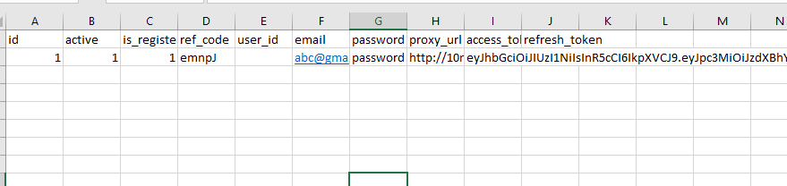
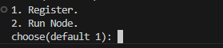

# ᝰ.ᐟ TENEO-NODE

Running Teneo Node BETA, CLI Version. <br>
Teneo Is an Browser extension Node Based. <br>


Get paid in $TENEO Tokens for simply running a node that accesses public social media data. It’s easy, passive, and you earn from the value you contribute.


## 💡 How To SignUp (Register)
TENEO EXTENSION NODE AIRDROP
TONEO NODE AURDROP
➡️ Download Extension : https://chromewebstore.google.com/detail/teneo-community-node/emcclcoaglgcpoognfiggmhnhgabppkm

Install Extension
Login / Create Account
Enter Ref Code : emnpJ (USE REF GOT 2500 Points)
Verify Email
Run Nodes Ektension
LFG

- **No Need Download the Extension you can register using script**


## 🚨 Attention Before Running Teneo Cli Version

I am not `responsible` for the possibility of an account being `banned`, due to running node in the CLI, because Officially `Teneo Node Beta` does not provide an option for the CLI version, only with the Chrome extension.
but `I think` there is no reason to ban the account, because this is not cheating, I didn't change anything in the script (Heartbeats 15 minutes, maximum teneo points 25, maximum points per day 2400)

## 📎 Teneo Node cli version Script features

- Register
- Login
- Running Node
- AutoLogin
- AutoReconnect


## 📌  ScreenShot Running With Javascript/NodeJs



Seeding 
- id 1->n
- active = 1 to run  != 1 to off
- is_register = 1 to register
- ref_code 
- email : email
- password : password
- proxy_url:http://username:password@ip:port
    access_token:"eyJhbGciOiJIUzI1NiIsImtpZCI6IjNESGJSNFRBOHdxNHlta3AiLCJ0eXAiOiJKV1QifQ.eyJpc3MiOiJodHRwczovL2lra25uZ3JneHV4Z2pocGxicGV5LnN1cGFiYXNlLmNvL2F1dGgvdjEiLCJzdWIiOiI4YmEwMDMxNC05NjVhLTQ1YzMtOWYzNC0xYzc2OTc5OWRlMGQiLCJhdWQiOiJhdXRoZW50aWNhdGVkIiwiZXhwIjoxNzMxMDI4MzM2LCJpYXQiOjE3MzA0MjM1MzYsImVtYWlsIjoiYmFuZ2Jvb25nMTk5OS5kZXZAZ21haWwuY29tIiwicGhvbmUiOiIiLCJhcHBfbWV0YWRhdGEiOnsicHJvdmlkZXIiOiJlbWFpbCIsInByb3ZpZGVycyI6WyJlbWFpbCJdfSwidXNlcl9tZXRhZGF0YSI6eyJlbWFpbCI6ImJhbmdib29uZzE5OTkuZGV2QGdtYWlsLmNvbSIsImVtYWlsX3ZlcmlmaWVkIjpmYWxzZSwiaW52aXRlZF9ieSI6ImVtbnBKIiwicGhvbmVfdmVyaWZpZWQiOmZhbHNlLCJzdWIiOiI4YmEwMDMxNC05NjVhLTQ1YzMtOWYzNC0xYzc2OTc5OWRlMGQifSwicm9sZSI6ImF1dGhlbnRpY2F0ZWQiLCJhYWwiOiJhYWwxIiwiYW1yIjpbeyJtZXRob2QiOiJwYXNzd29yZCIsInRpbWVzdGFtcCI6MTczMDQyMzUzNn1dLCJzZXNzaW9uX2lkIjoiMzRhMWE0ZDEtZGFlNC00YzYxLTlmODQtN2Y0M2YxZGQwNjM1IiwiaXNfYW5vbnltb3VzIjpmYWxzZX0.To2rhoIV3VM0TlnvjI-E9DtjJdelbNqkNgRmQF555XM"
## ✎ᝰ. RUNNING 
- Clone Repository
- Install Dependency
```bash
npm install
```
- Run the script
```bash

node main.js
1:Register
2:Auto Run Node
```
